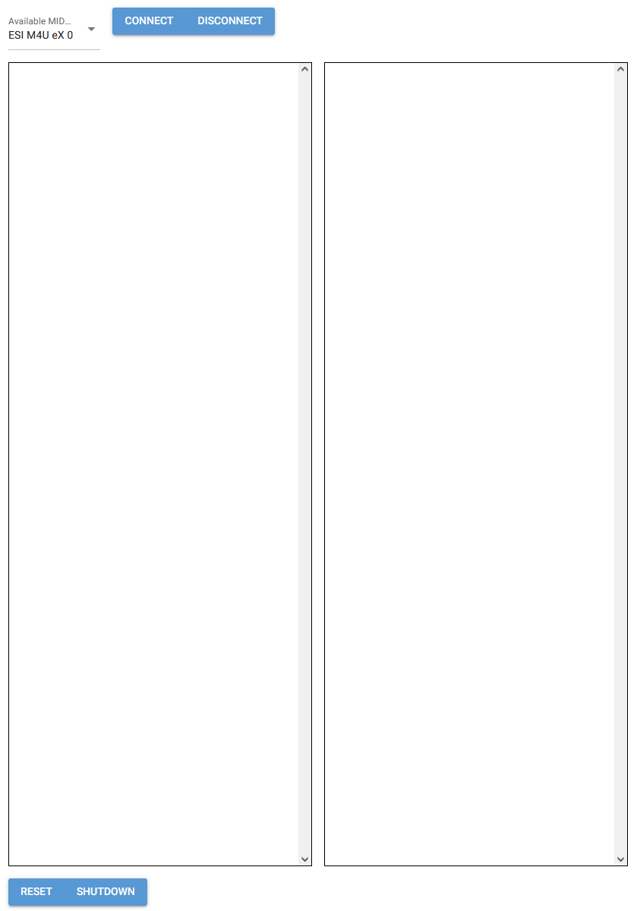

## Browser MIDI monitor

Surprisingly, it can be quite hard to find a decent MIDI monitor for windows. And since I wanted to play around with MIDI coding and NiceGUI anyway, this seemed like a good project for that.



In the UI it is possible to select a MIDI device and connect and disconnect from it. All MIDI messages show up in the textboxes (50 messages in each). For now this is all it does, since this is all I need (just a simple tester for MIDI connections). But I might expand this later to at least a better visualisation of the incoming MIDI messages.

For now this is meant to be used standalone by starting the program from the commandline:

```sh
python midiMonitor.py
```

You can clone my Conda environment using the `environment.yaml` file with the following command

```sh
conda env create --file=environment.yaml
```

The minimal required dependencies are (see below for doc links):
- mido
- python-rtmidi
- nicegui

Currently, I have only tested this on my own Windows PC.

### Details
The `MidiMonitor` class holds the last 100 MIDI messages (in a deque, configured with a max length of 100). Rtmidi delivers the data in byte format, so mido is used to parse the message and this is directly converted into a string to display. There is a lot to gain here in terms of verstility and visualisation, but for now this works fine.
The connect and disconnect methods are coupled directly to the UI buttons at the top. A MIDI port must be selected before connecting.

### TODO
- Improve visualisation
- Add MIDI functions (possibly sending data)

### References
- https://nicegui.io/
- https://mido.readthedocs.io/en/stable/index.html
- https://spotlightkid.github.io/python-rtmidi/rtmidi.html
- https://docs.python.org/3/library/collections.html#collections.deque